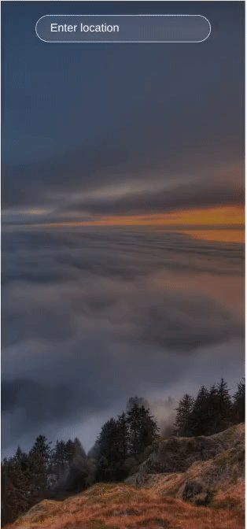

# Omnifood Landing Page

## Description
This project was developed from a figma design as a weather application. It has a search input in which the user can write a city name. Once the user hits "Enter", the application downloads weather data from the OpenWeather API and displays information such as temperature, wind speed, humidity, etc. for the specified city. The most significant challenge in creating this application was manipulating the API data requisition and linking it to the user's commands.

This project was mostly built in React, and it was a great way for me to practice state management with useState and useEffect. I was also able to review API consumption and conditional rendering.

## Screenshots

### Mobile

## Live webpage
https://preeminent-speculoos-1e6550.netlify.app/
